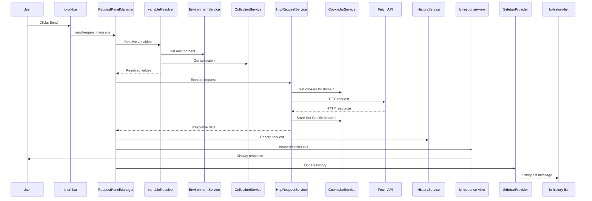

LiteClient is built as a native VS Code extension using a three-tier architecture that separates business logic, communication protocols, and user interface. This design prioritizes performance, privacy, and native IDE integration.

## Overview

LiteClient is a lightweight REST API client that runs entirely within VS Code. All data persists locally with no external services or telemetry. The extension follows VS Code's extension architecture patterns and leverages native platform capabilities.

## Three-Tier Architecture

The extension is organized into three distinct layers:

### 1. Extension Module

Runs in the VS Code extension host process (Node.js environment).

**Responsibilities**:
- Business logic for collections, environments, history
- HTTP request execution with Node.js capabilities
- File I/O and data persistence
- Cookie management and OAuth2 flows
- Command registration and handling

**Key Components**:
- Services (business logic)
- Commands (user-invokable actions)
- Providers (webview lifecycle management)
- Storage (JSON file persistence)

### 2. Message Protocol

Typed communication layer between extension and webview.

**Features**:
- Type-safe message definitions
- Bidirectional communication
- Request/response patterns
- State synchronization

**Message Types**:
- Request execution (`send-request`)
- Response delivery (`response`)
- State updates (`collections-list`, `environments-list`, `history-list`)
- User actions (create, update, delete operations)

### 3. Webview Module

Runs in a webview context (browser-like environment).

**Responsibilities**:
- User interface rendering
- Form input and validation
- Response visualization
- Request/response editing

**Technology Stack**:
- Lit web components
- CodeMirror 6 for code editing
- Native HTML/CSS for performance

## Extension Module Architecture

### Services Layer

The services layer encapsulates all business logic:

<Tabs>
  <Tab title="CollectionService">
    **File**: `collectionService.ts`
    
    **Responsibilities**:
    - CRUD operations for collections, folders, and requests
    - Postman Collection v2.1 import/export
    - Nested folder hierarchy management
    - Request metadata persistence
    
    **Storage**: `collections.json`
  </Tab>
  
  <Tab title="EnvironmentService">
    **File**: `environmentService.ts`
    
    **Responsibilities**:
    - Environment and variable management
    - Global variables (shared across all requests)
    - Variable enable/disable toggling
    - Secret variable handling
    
    **Storage**: `environments.json`
  </Tab>
  
  <Tab title="HistoryService">
    **File**: `historyService.ts`
    
    **Responsibilities**:
    - Request execution tracking
    - Day-grouped organization
    - History search and filtering
    - History item deletion
    
    **Storage**: `history.json`
  </Tab>
  
  <Tab title="HttpRequestService">
    **File**: `httpRequestService.ts`
    
    **Responsibilities**:
    - HTTP client with Node.js Fetch API
    - Variable substitution in URL, headers, body
    - Request timeout handling
    - Redirect following
    - Response capture and formatting
    
    **Storage**: None (stateless)
  </Tab>
  
  <Tab title="CookieJarService">
    **File**: `cookieJarService.ts`
    
    **Responsibilities**:
    - Cookie persistence per domain
    - Automatic cookie sending with requests
    - Set-Cookie header capture
    - Cookie expiration management
    
    **Technology**: tough-cookie library  
    **Storage**: `cookies.json`
  </Tab>
  
  <Tab title="OAuth2TokenService">
    **File**: `oauth2TokenService.ts`
    
    **Responsibilities**:
    - OAuth2 token acquisition
    - Token caching and refresh
    - PKCE support
    - Authorization Code and Client Credentials flows
    
    **Storage**: VS Code SecretStorage (encrypted)
  </Tab>
  
  <Tab title="SettingsService">
    **File**: `settingsService.ts`
    
    **Responsibilities**:
    - User preferences
    - UI state persistence
    - Workspace-specific settings
    
    **Storage**: `settings.json`
  </Tab>
</Tabs>

### Service Patterns

All services follow consistent design patterns:

- **Constructor injection**: StorageService injected via constructor
- **Async/await**: All I/O operations are asynchronous
- **Error handling**: Descriptive errors thrown for invalid operations
- **Single responsibility**: Each service owns a specific domain

```typescript
// Example service pattern
class EnvironmentService {
  constructor(private storage: StorageService) {}
  
  async getEnvironments(): Promise<Environment[]> {
    return await this.storage.read<Environment[]>('environments.json');
  }
  
  async createEnvironment(name: string): Promise<Environment> {
    // Implementation
  }
}
```

### Providers Layer

Providers manage webview lifecycle and message routing:

<ParamField path="SidebarProvider" type="provider">
  Manages the sidebar webview with Collections, Environments, and History tabs.
  
  **Lifecycle**:
  - Creates webview on sidebar activation
  - Loads HTML/CSS/JS for sidebar UI
  - Routes messages between webview and services
  - Handles state synchronization
</ParamField>

<ParamField path="RequestPanelManager" type="provider">
  Creates and manages request editor panels (custom editor for `.lcreq` files).
  
  **Lifecycle**:
  - Opens panel when `.lcreq` file is opened
  - Loads request data from file
  - Handles OAuth2 flows via URI handler
  - Saves request changes back to file
</ParamField>

<ParamField path="CookieManagerProvider" type="provider">
  Manages the cookie manager webview panel.
  
  **Lifecycle**:
  - Opens on command invocation
  - Displays all cookies grouped by domain
  - Handles cookie editing and deletion
</ParamField>

### Commands Layer

Commands are user-invokable actions registered in `package.json`:

| File | Commands |
|------|----------|
| `collectionCommands.ts` | Collection CRUD, import/export |
| `environmentCommands.ts` | Environment and variable operations |
| `historyCommands.ts` | History access and management |
| `requestCommands.ts` | New request creation |
| `cookieCommands.ts` | Cookie management commands |

**Command Pattern**:
```typescript
export function registerNewRequest(deps: CommandDependencies) {
  return vscode.commands.registerCommand('liteclient.newRequest', async () => {
    // Command implementation
  });
}
```

## Webview Architecture

### Request Editor Components

The request editor is built with Lit web components:

- **lc-url-bar**: URL input with HTTP method selector
- **lc-tabs**: Tab navigation for request sections
- **lc-headers-table**: Key-value editor for headers
- **lc-body-panel**: Request body editor with format support
- **lc-auth-panel**: Authentication configuration (OAuth2, Bearer, Basic)
- **lc-form-data-editor**: Multipart form-data with file uploads
- **lc-variable-autocomplete**: Environment variable autocomplete (`{{var}}`)
- **lc-response-view**: Response display with syntax highlighting
- **lc-cookies-table**: Response cookies viewer
- **lc-status-bar**: Response status, timing, size
- **lc-request-meta**: Request metadata (name, description)

### Sidebar Components

- **lc-sidebar-panel**: Main container with tabs
- **lc-collection-tree**: Hierarchical collection browser
- **lc-env-switcher**: Environment selector dropdown
- **lc-environment-list**: Environment and variable management
- **lc-history-list**: Day-grouped request history
- **lc-cookie-manager**: Cookie management interface

### Shared Components

Shared across request editor and sidebar:

- **models.ts**: TypeScript data models (Environment, Collection, Request, etc.)
- **messages.ts**: Typed message definitions for extension communication
- **variableSubstitution.ts**: `{{variableName}}` substitution logic
- **variableResolver.ts**: Centralized variable resolution with layered precedence

## Data Storage

### Storage Architecture

LiteClient uses a JSON file-based storage system:

```text
[Storage Directory]
├── collections.json     # Collections, folders, requests
├── environments.json    # Environments and variables
├── history.json         # Request execution history
├── cookies.json         # Serialized cookie jar
└── settings.json        # User preferences
```

### Storage Scopes

<Tabs>
  <Tab title="Global Storage">
    **Location**: VS Code's `globalStorageUri`
    
    **Characteristics**:
    - Private to the user
    - Not stored in project repository
    - Available across all workspaces
    - Platform-specific location
    
    **Use Case**: Personal API testing, sensitive credentials
  </Tab>
  
  <Tab title="Workspace Storage">
    **Location**: `.liteclient/` in workspace root
    
    **Characteristics**:
    - Shareable via Git
    - Project-specific
    - Team collaboration
    - Version controlled
    
    **Use Case**: Shared API collections, team environments
  </Tab>
</Tabs>

### StorageService

Provides atomic file operations with corruption recovery:

```typescript
class StorageService {
  async read<T>(filename: string): Promise<T>
  async write<T>(filename: string, data: T): Promise<void>
  async delete(filename: string): Promise<void>
  async exists(filename: string): Promise<boolean>
}
```

**Features**:
- Atomic writes (write to temp file, then rename)
- Backup on corruption detection
- JSON schema validation
- Error recovery

## Request Execution Flow

The complete flow from user action to response display:



### Variable Resolution Order

Variables follow a layered precedence (narrowest scope wins):

1. **Globals** - Shared across all requests
2. **Collection** - Available to all requests in a collection
3. **Environment** - Scoped to selected environment

<Note>
  Only **enabled** variables are resolved. Disabled variables are ignored during substitution.
</Note>

## Extension Initialization

Startup sequence when VS Code activates the extension:

1. `extension.activate()` called
2. Create `StorageService` (determines scope from settings)
3. Instantiate all services with `StorageService` injection
4. Register `SidebarProvider` for sidebar webview
5. Register `RequestPanelManager` for `.lcreq` custom editor
6. Register `CookieManagerProvider` for cookie manager panel
7. Register URI handler for OAuth2 callbacks
8. Register all commands with `CommandDependencies`
9. Extension ready for user interaction

## Performance Considerations

- **Lazy loading**: Webviews created only when needed
- **Efficient messaging**: Only changed state synchronized
- **JSON streaming**: Large responses streamed to webview
- **CodeMirror**: Virtual scrolling for large documents
- **Indexed lookups**: Fast collection/environment retrieval

## Security Model

- **Local-only**: No external network calls except user requests
- **No telemetry**: Zero tracking or analytics
- **SecretStorage**: OAuth tokens stored in VS Code's encrypted storage
- **Sandboxed webviews**: Isolated execution context
- **Script sandboxing**: Pre-request/test scripts run in Node.js `vm` sandbox
